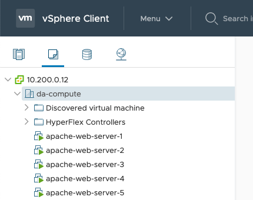

|Technology|Category|Product|Languages|
|----------|--------|-------|---------|
|Cloud|Data Center,Open Source|AppDynamics|Hashicorp Configuration Language (HCL)|

# Automate deployment of virtual machines and AppDynamics Machine Agent
 This solution is an example of how to get started with monitoring and observability using AppDynamics's Machine Agent. The example details how to:
 * Use Terraform to deploy five virtual machines in vSphere followed by the installation of Apache and the AppDynamics Machine Agent using Ansible.
 * Once Terraform provisions the virtual machines, a provisioner within Terraform calls the Ansible playbook that installs Apache, Docker, and the AppDynamics Machine Agent.

The main objective is to get started with monitoring your infrastructure by showing an automated way of getting the AppDynamics agent installed, so that you have observability baked into an environment from the onset. We first start with the use case of monitoring virtual machines with follow-on use cases showing how Kubernetes clusters, databases, and applications are brought into the fold to ultimately provide a full-stack view of your operations in real time.

## Requirements

Here is a list of dependencies to make this work in your environment:

- vSphere 6.7 or higher
- Terraform v0.15.2 or higher
- Ansible 2.10.2

- A virtual machine template with CentOS 8.2 installed as the guest OS

## Credentials

We purposely did not add credentials and other sensitive information to the repo by including them in the `.gitignore` file. As such, if you clone this repo, you must create two files. 
- first file named `secret.tfvars` contains sensitive Terraform variables. 
- second file named `variables.yml` is used by Ansible. 
In this scenario, we encrypted `variables.yml` using the command `ansible-vault` command and decrypt it as needed locally. You could take the same approach or leave the file unencrypted if you are confident it will not be shared or inadvertently uploaded to a repo.

Here is a list of variables you must include and define for each file.

- `secret.tfvars` in HCL format (file is in the same directory as the `terraform.tfvars` file):
  - vsphere_user
  - vsphere_password
  - vsphere_server (the IP address or FQDN)
  - vsphere_vm_firmware (default is `vsphere_vm_firmware = bios`)
  - ssh-pub-key (an SSH key used with a service account that allows Ansible to connect over SSH)
  - service_account_username
  - service_account_password
- `variables.yml` (written in YAML) file:

## What Terraform Provisions

In this example, Terraform uses the `vsphere` provider and a `vsphere_virtual_machine` resource to:

- Create five virtual machines from virtual machine template.
- Add the SSH key of a service account to each host.
- Run an Ansible playbook that performs the steps in the next section.

## What Ansible Installs and Configures

After Terraform creates five virtual machines, the Ansible playbook installs and configures:

- Apache Web Server
- Firewall with port 80 opened
- Docker
- DNS (resolv.conf is configured)

Each Apache Web Server is configured with a custom (using a Jinja template) `index.html` page that displays the hostname.

The same approach is taken with the AppDynamics Machine Agent. In other words, a Jinja template creates a custom file for each containing the hostname.

## Creating and Applying the Terraform Plan

Here are the steps that guide you to run Terraform along with examples of each:

1. Initialize Terraform:
    
`terraform init  -var-file="secret.tfvars"`

2. Create a Terraform Plan:

`terraform plan -out appd-machine-agent-installation.tfplan -var-file="secret.tfvars"`

3. Apply the Terraform Plan:

`terraform apply -var-file="secret.tfvars"`

Each of these commands includes the `secret.tfvars` containing the sensitive variables that are needed to connect to the different resources as described in the previous section.

## Results

### Virtual Machines

You see five virtual machines that are created with static IP addresses in vSphere.

### Apache Web Servers

Each Apache server has a custom `index.html` file that includes the hostname of the machine.

